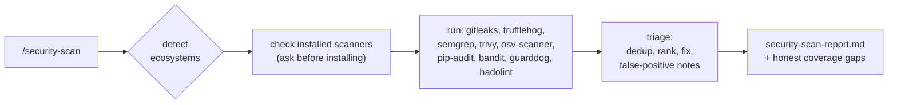

# claude-security-kit

[](https://github.com/akshayramabhat/claude-security-kit/actions/workflows/validate.yml)
[](https://claude.com/claude-code)
[](LICENSE)

**Vibe-coded your app? Scan it before you ship.**

`/security-scan` runs every major open-source security scanner over your repo in
one command (secrets, SAST, dependency CVEs, container and IaC misconfig, and
malicious packages), then triages the raw noise into one prioritized, honest
report. No new SaaS, no account, no telemetry. The scanners are tools you already
trust; this just orchestrates them and makes the output usable.

It also ships a Postgres Row-Level Security auditor and a data-API lockdown kit.

## How it works



## Quick start

Add this repo to your Claude Code plugins, then run the skill:

```
/security-scan
```

The skill detects your stack, runs the scanners, and writes
`security-scan-report.md`. On the first run it checks which scanners are installed
and offers to install any that are missing in one step, grouped by package manager
(for example "trivy, gitleaks via brew; bandit, pip-audit via pipx. Install all
now?"). Nothing is installed without that single confirmation, so you do not need
to install the scanners by hand first.

## What it catches

One pass covers five attack surfaces with no overlap-noise:

| Surface | Tools |
|---|---|
| Secrets (broad + verified) | gitleaks, trufflehog |
| Code vulnerabilities (SAST) | semgrep, bandit (Python) |
| Dependency CVEs | trivy, osv-scanner, pip-audit, npm/pnpm/yarn audit |
| Container + IaC misconfig | trivy, hadolint |
| Malicious / typosquatted packages | guarddog |

Opt-in flags add OpenSSF Scorecard (`--scorecard`), Checkov (`--checkov`), and
Grype+Syft (`--grype`). CodeQL is intentionally not bundled; its license is not
OSI open source. Full roster, install commands, and licenses:
[`skills/security-scan/reference.md`](skills/security-scan/reference.md).

## Example report

```markdown
## Summary
No findings from the tools that ran. Coverage is partial: 6 of 8 in-scope tools
were skipped because they are not installed. This is NOT a clean bill of health.

## Tools run
- trivy 0.x (scanners: secret, misconfig)

## Tools skipped (not installed)
- gitleaks    secrets + git history    install: brew install gitleaks
- trufflehog  verified secrets         install: brew install trufflehog
- ...

## Coverage gaps
No SAST, no dependency CVE scan, and no malicious-package check were performed.
Install the skipped tools and re-run before treating this repo as scanned.
```

The kit never claims a repo is clean when tools were skipped. It reports what ran,
what did not, and what that leaves unchecked.

## Also includes: Postgres RLS lockdown kit

A common way to leak a database is an over-exposed Supabase or Postgres Data API
where Row-Level Security is off or silently misconfigured. The kit ships:

- **`rls-policy-reviewer` agent**: a read-only auditor that catches missing or
  broken RLS in migrations before they ship.
- **`templates/rls/`**: copy-paste policy shapes for five ownership tiers, plus a
  `verify.sql`.
- **[`docs/supabase-data-api-lockdown.md`](docs/supabase-data-api-lockdown.md)**:
  a vendor-neutral guide to the three ways RLS silently fails and how to fix them.

## Prerequisites and licenses

The scanners are external binaries. The skill checks for them on the first run and
offers to install any that are missing in one batched step (grouped by package
manager), but never installs without your confirmation. Each tool keeps its own
license:

| Tool | License | | Tool | License |
|---|---|---|---|---|
| gitleaks | MIT | | guarddog | Apache-2.0 |
| trufflehog | AGPL-3.0 | | hadolint | GPL-3.0 |
| semgrep | LGPL-2.1 | | OpenSSF Scorecard | Apache-2.0 |
| trivy | Apache-2.0 | | Checkov | Apache-2.0 |
| osv-scanner | Apache-2.0 | | Grype / Syft | Apache-2.0 |
| pip-audit | Apache-2.0 | | bandit | Apache-2.0 |

This kit only invokes installed binaries. It does not redistribute or link any
scanner, so the AGPL, LGPL, and GPL tools above do not affect its own MIT license.
Running third-party scanners is itself a small supply-chain surface, so pin tool
versions where you can. A scan is point-in-time, not a guarantee.

## Contributing

Issues and PRs welcome. See [CONTRIBUTING.md](CONTRIBUTING.md).

## License

MIT.
